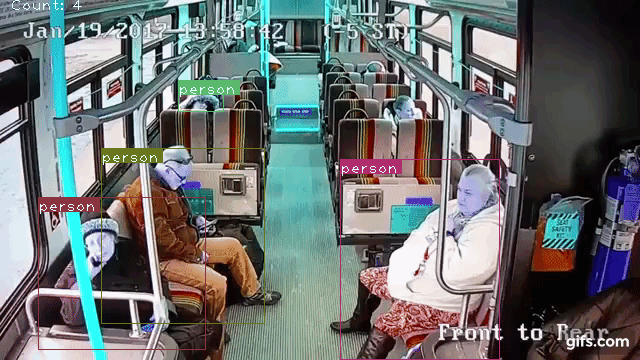

# People Counting  Yolo 3




based on:

https://blog.paperspace.com/tag/series-yolo/

https://github.com/ayooshkathuria/YOLO_v3_tutorial_from_scratch?ref=blog.paperspace.com


# Using the original multi-class object detection:

```python detect.py --images dog-cycle-car.png --det det```

```python video.py --video metro.gif```

# Changes relative to original project: 
- migrating to  up-to-date packages
- adding people counting mode
- saving sample gif

### Counting people mode:
 ```python video.py --count_people --video  metro.gif```

### for saving video:
 ```conda install conda-forge::imageio```

### Saving sample: 
```python video.py --video --count_people --save_sample metro.gif``` 


# Setup

### Current system -known to be working on :
- MacOS 12.5.1

- pytorch                   2.3.1

- python                    3.12.4

- numpy                     2.0.0

- opencv                    4.10.0 

### Setup

- ```conda install python conda-forge::opencv pytorch::pytorch numpy pandas```
- ```wget https://pjreddie.com/media/files/yolov3``` 


# YOLO_v3_tutorial_from_scratch
Accompanying code for Paperspace tutorial series ["How to Implement YOLO v3 Object Detector from Scratch"](https://blog.paperspace.com/how-to-implement-a-yolo-object-detector-in-pytorch/)

Here's what a typical output of the detector will look like ;)


## About the training Code

This code is only mean't as a companion to the tutorial series and won't be updated. If you want to have a look at the ever updating YOLO v3 code, go to my other repo at https://github.com/ayooshkathuria/pytorch-yolo-v3

Also, the other repo offers a lot of customisation options, which are not present in this repo for making tutorial easier to follow. (Don't wanna confuse the shit out readers, do we?)

About when is the training code coming? I have my undergraduate thesis this May, and will be busy. So, you might have to wait for a till the second part of May. 

Cheers

